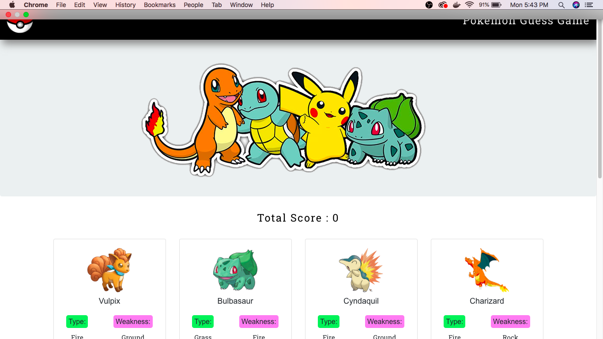

# Overview

(Desktop Only!!!)

For this project, I created a memory game with React. This project required me to break up the application's UI into components, manage component state, and respond to user events.

## Technologies Used

1. React.js
2. HTML5
3. CSS3
4. BootStrap
5. W3 CDN

### Screenshot of App

### Gif of working App

